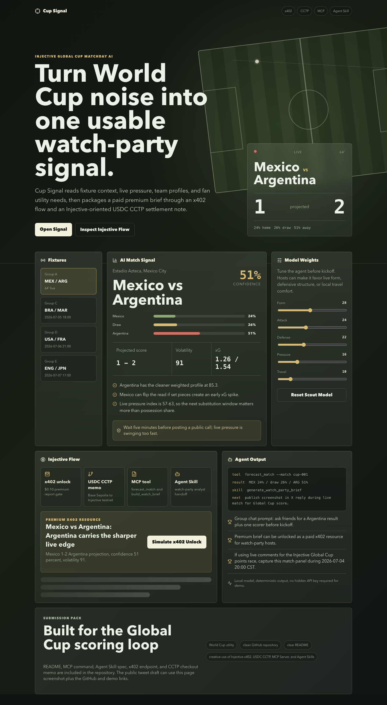
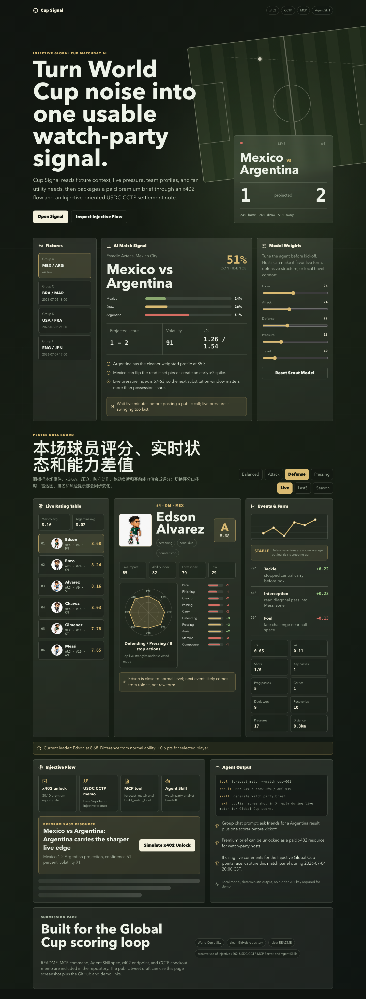

# Cup Signal for Injective Global Cup

Cup Signal is a World Cup matchday AI cockpit built for **The Injective Global Cup**. It helps fans and watch-party hosts turn noisy match context into one usable signal: win probability, projected score, tactical read, group-chat prompt, and a premium report unlock flow.

The project is intentionally small enough for judges to run quickly, but it includes all four Injective challenge hooks:

- **x402**: a pay-per-request premium report endpoint shape using HTTP 402.
- **USDC CCTP**: each paid brief includes a USDC settlement memo from Base Sepolia to Injective testnet.
- **MCP Server**: local MCP tools expose fixtures, forecasts, watch briefs, and team ranking.
- **Agent Skill**: a portable skill file teaches an agent how to use the MCP tools for live match commentary.





## What It Solves

During a World Cup match, fans usually jump between score apps, social feeds, group chats, and prediction threads. Cup Signal compresses that into one workflow:

1. Pick a match.
2. Tune the model weights for form, attack, defense, pressure, and travel.
3. Read the AI signal and volatility.
4. Inspect the player dashboard: live rating, current-form-vs-normal ability deltas, radar profile, event timeline, and risk.
5. Generate a watch-party prompt or live X reply.
6. Unlock the premium brief through an x402-style paid API resource.
7. Use the CCTP memo as the settlement note when moving USDC into Injective-oriented flows.

This is not betting advice. It is a fan utility and AI-agent demo for matchday discussion.

## Demo Commands

```bash
npm install
npm run dev
```

Open the Vite URL shown in the terminal.

Live demo:

```text
https://chengyuann.github.io/cup-signal-injective/
```

Build check:

```bash
npm run build
```

Run the dry-run x402 report service:

```bash
npm run server:x402
curl -i http://127.0.0.1:4020/api/premium-report/cup-001
curl -i -H 'X-PAYMENT: demo-paid' http://127.0.0.1:4020/api/premium-report/cup-001
curl -i http://127.0.0.1:4020/api/player-ratings
```

Run the MCP verification:

```bash
npm run check:mcp
```

Run a plain agent demo:

```bash
npm run demo:agent
```

Capture local demo screenshots after `npm run dev` is running:

```bash
npm run capture
```

## Injective Integration Notes

### x402

`server/x402-report-server.ts` exposes:

- `GET /api/free-brief/:matchId`
- `GET /api/premium-report/:matchId`

Without an `X-PAYMENT` header, the premium route returns a 402 response with payment requirements. With a demo header, it returns the premium report and `X-PAYMENT-RESPONSE`. The default server is dry-run so judges can test it without spending funds or provisioning API keys.

Production path:

1. Replace `X402_RECEIVER` with the real receiving address.
2. Set the target network and supported asset.
3. Wire `@x402/express` plus a facilitator to verify and settle `X-PAYMENT`.
4. Keep the same premium report resource path.

### USDC CCTP

`buildWatchBrief()` returns:

```json
{
  "source": "Base Sepolia",
  "destination": "Injective testnet",
  "token": "USDC",
  "memo": "cup-signal:cup-001:watch-brief"
}
```

This is used as the checkout/settlement intent for a fan host who wants to pay or settle cross-chain in USDC. In production, the memo can be attached to a real CCTP transfer flow.

### MCP Server

The MCP server is in `mcp/cup-signal-mcp.ts`.

Tools:

- `list_fixtures`
- `forecast_match`
- `build_watch_brief`
- `rank_teams`
- `rank_match_players`

Resource:

- `cup-signal://event`

Prompt:

- `global_cup_commentary`

Run it with:

```bash
npm run mcp
```

An agent can combine this local MCP server with the official Injective MCP server when it needs live Injective trading, bridging, or EVM transaction capabilities.

### Agent Skill

The skill file lives at:

```text
agent-skill/SKILL.md
```

It tells an agent how to call Cup Signal MCP tools, generate a short match read, and prepare a live `#InjectiveGlobalCupHackathon` update without claiming a real on-chain payment happened.

## Project Structure

```text
src/
  data.ts          Demo fixture and team data
  forecast.ts      Deterministic AI-style prediction and brief builder
  players.ts       Player stats, ability baselines, live ratings, and scoring model
  main.tsx         React app
  styles.css       Interface styling
server/
  x402-report-server.ts
mcp/
  cup-signal-mcp.ts
agent-skill/
  SKILL.md
scripts/
  check-mcp.ts
  agent-demo.ts
docs/
  SUBMISSION.md
  INJECTIVE_REFERENCES.md
```

## Why Judges Should Care

- It is usable by non-Web3 football fans immediately.
- It has a clean, inspectable TypeScript model rather than a static mockup.
- It now includes detailed match player ratings, ability-vs-current-form comparisons, live event timelines, and generated chibi player art.
- The x402/CCTP/MCP/Agent Skill surfaces are tied to the product flow, not pasted on as logos.
- It creates repeatable live-match screenshots and X reply material for the Global Cup points race.

## Player Dashboard

The player board adds a detailed match layer on top of the team forecast:

- 6 demo players from the Mexico vs Argentina match context.
- 10 baseline ability dimensions per player.
- 10 current-form ability dimensions per player.
- 28 live stat fields covering xG, xA, shots, progressive actions, duels, tackles, recoveries, pressures, distance, and sprint load.
- Rating modes: `balanced`, `attack`, `defense`, `pressing`.
- Time windows: `live`, `last5`, `season`.
- Dynamic radar chart, dual baseline/current bars, form trend, event timeline, and risk signal.
- GPT Image 2 generated original chibi-style player avatars. The prompts avoid official logos, crests, watermarks, and photorealistic likeness claims.

## Verified Locally

- `npm run build`
- `npm run check:mcp`
- `npm run demo:agent`
- `npm run capture`
- x402 dry-run `curl` returned `402 Payment Required`, then `200 OK` with `X-PAYMENT-RESPONSE` when a demo `X-PAYMENT` header was supplied.

## Limitations

- Fixture and team data are demo data. Replace `src/data.ts` with a licensed live sports feed for production.
- The x402 route is dry-run by default. Real settlement requires a receiving wallet and facilitator credentials.
- The CCTP memo is an intent object, not an executed transfer.
